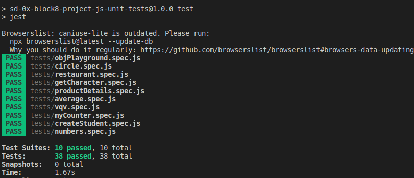

<h1 align="center">:test_tube: JS Unit Tests :test_tube:</h1>

## 📰 Sobre o projeto

Primeiro projeto focado em testes unitários utilizando o módulo Jest do NodeJS. Pude a partir de testes já implementados, escrever funções de forma que elas atendam aos testes propostos e escrever testes e funções utilizando uma abordagem de desenvolvimento orientado a testes.

## 🛠 Tecnologias

As seguintes ferramentas foram usadas na construção do projeto:
-  **[Jest](https://jestjs.io/docs/getting-started)**
